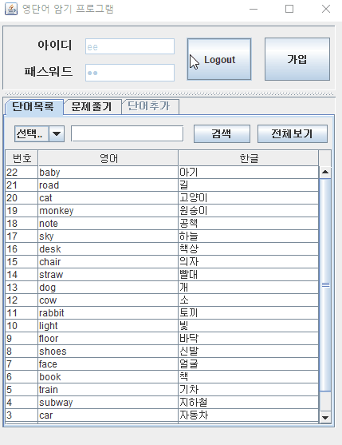
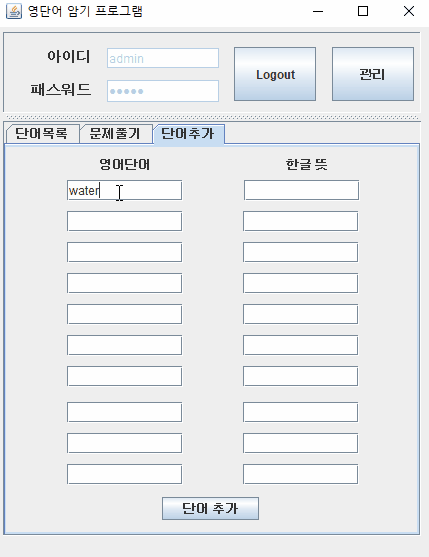
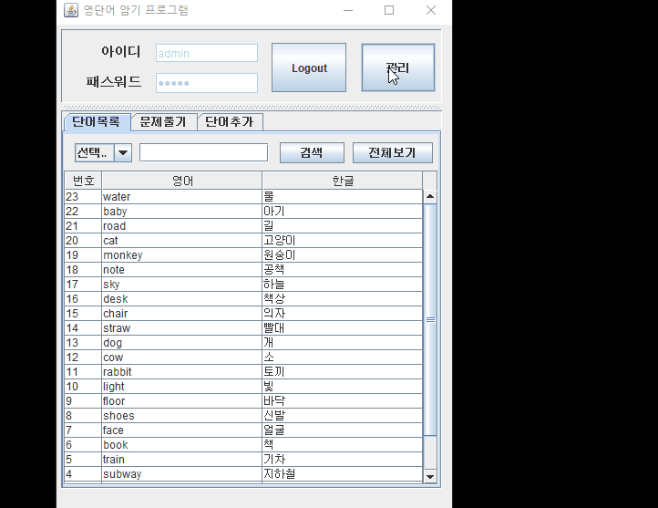
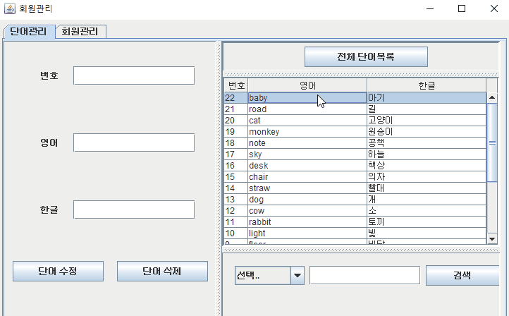
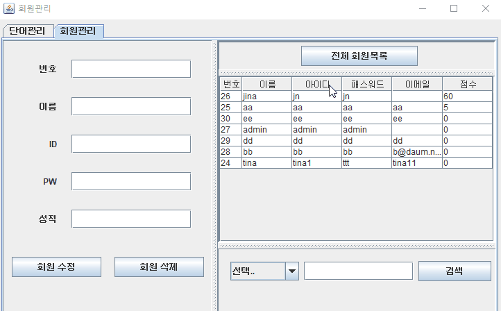
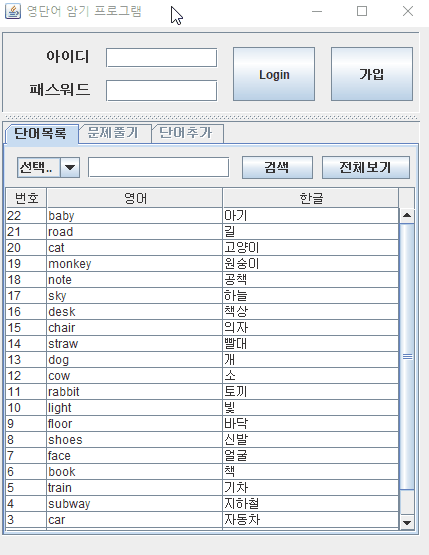
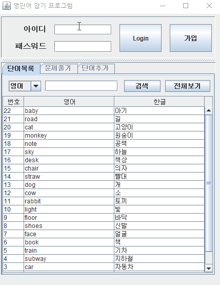
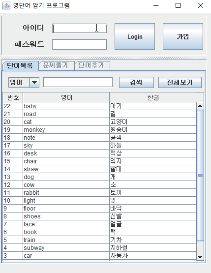
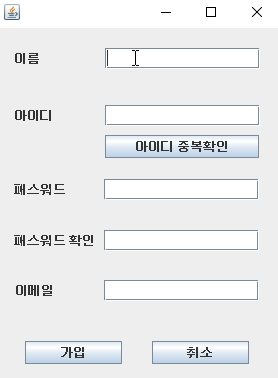

# Java Swing First Project
## English Word Test Application
> This is my first Java Swing Project. I want to make a English word study & test application.
+ AdminView: Java GUI file for managing words and signed up people. This file need to be opened with window builder editor.

+ GUIView: Java GUI file for main application system. This file need to be opened with window builder editor.

+ Member: This file contains global variables and getter, setter for MemberDAO, MemberDAOImpl.
+ MemberDAO, MemberDAOImpl: These files are related to member sql connection.
+ SignupView: Java GUI file for sign up form. This file need to be opened with window builder editor.

+ Word: This file contains global variables and getter, setter for WordDAO, WordDAOImpl.
+ WordDAO, WordDAOImpl: These files are related to word sql connection.